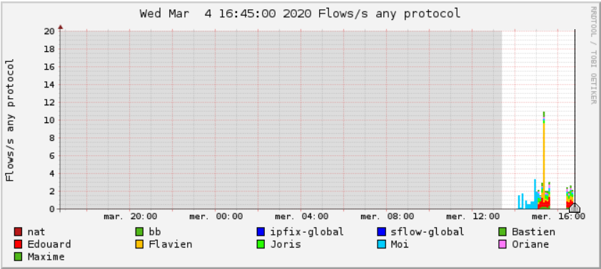
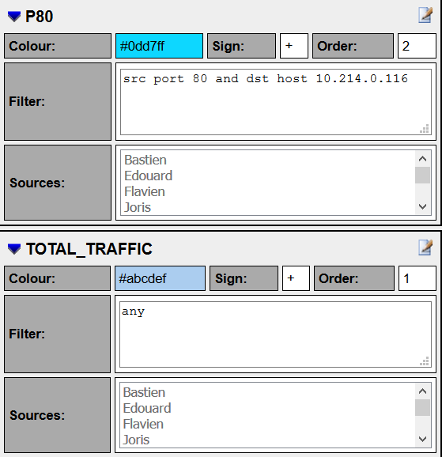
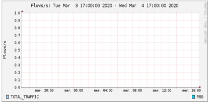

# TP3/4 Netflow

J'installe FProbe. Je modifie ensuite son fichier de configuration pour mettre les IP et le port 1564 (Le mien) pour chaque poste.

Je clone le repository git donné. Je fais ensuite : 

```docker-compose up -d nfsen```

Je me met dans le dossier git au préalable.

Je rentre dans le fichier data/nfsen/etc/nfsen.conf (Dans le container docker)(Dans la partie %sources)data

'Joris' => { 'port' => '1562', 'col' => '#50B719', 'type' => 'netflow' },

'Edouard' => { 'port' => '1560', 'col' => '#50B719', 'type' => 'netflow' },

'Oriane' => {'port'=>'1563','col'=>'#50B719','type'=>'netflow'},

'Moi' => {'port'=>'1564','col'=>'#50B719','type'=>'netflow'},

'Flavien' => {'port'=>'1566','col'=>'#50B719','type'=>'netflow'},

'Bastien' => {'port'=>'1567','col'=>'#50B719','type'=>'netflow'},

'Maxime' => {'port'=>'1569','col'=>'#50B719','type'=>'netflow'},
 
Je rentre dans le navigateur ```10.214.0.116:6080/nfsen```

Je vois sur les graphes une barre 
Je clique sur le graphe en question et je vois que c'est mon traffic. Mais je ne vois que mon traffic. 



Je crée ensuite les groupes.

Pour le channel avec le port 80, j'ai mis comme ip de destination l'ip de ma VM (qui contient nfsem). 

J'ai mis un autre channel sans filtre avec tout le monde comme source. 



Mais je ne vois aucun flux. ALors que je devrais au moins voir le flux du channel "ALL"



Le grand Pouchou configure mon GNS3

Je commence la configuration de mon routeur

interface FastEthernet0/0
ip address dhcp  
duplex auto
speed auto !
interface FastEthernet0/1
ip address 172.18.255.254 255.255.0.0
duplex auto
speed auto 

J'arrive à ping la patte du routeur vers le "cloud" mais pas les autres machines de la salle.
